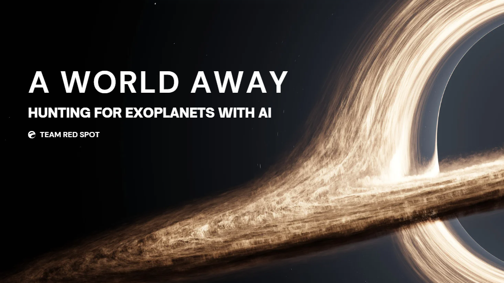

# Project-Rosetta
Project Rosetta was developed for the NASA Space Apps Challenge 2025 under the theme “A World Away: Hunting for Exoplanets with AI.”

  

This model transforms exoplanet hunting into a transparent, explainable, and interactive AI experience by merging the precision of machine learning with the curiosity of human exploration. It an AI-powered, explainable system that detects potential exoplanets from stellar light curve data, the brightness variations of stars recorded by space telescopes like Kepler and TESS.
Unlike typical “black-box” AI models, Rosetta not only identifies whether a signal indicates an exoplanet but also explains why it made that decision.
🌌 The process works as follows:
1. The user uploads stellar flux data (.csv) through a React-based dashboard.
2. The Flask backend processes the file, applies preprocessing (noise filtering, normalization, and balancing), and runs machine learning or deep learning models trained on NASA’s Kepler dataset.
3. The AI model (Random Forest, Gaussian Naive Bayes, or CNN) predicts whether the signal represents an exoplanet.
4. The system generates explainability reports, highlighting which features or time steps most influenced the decision.
5. The frontend visualizes results through interactive charts, confidence scores, and interpretability graphs — helping scientists understand each classification.
   
🌍 What benefits does it have?
- Transparency: Unlike traditional AI, Rosetta provides feature-level explanations, increasing scientific trust in machine predictions.
- Efficiency: Automates exoplanet candidate identification from large datasets, drastically reducing manual inspection time.
- Accessibility: Offers a web-based interface for researchers, educators, and enthusiasts so that there is no need for specialized software or coding.
- Scalability: Designed to integrate new telescope data and support additional models or real-time data streams.
  
🚀 Intended Impact
Rosetta aims to democratize exoplanet discovery by combining accuracy with interpretability. Its broader impacts include:
- Empowering astronomers with explainable AI tools that accelerate discovery and reduce uncertainty.
- Promoting open, trustworthy AI in space science, where human validation is crucial.
- Enabling citizen scientists and students to explore space data through an intuitive, visual platform.
- Contributing to the global search for habitable worlds beyond Earth — with AI that not only predicts but also justifies.
  
🧰 Tools, Languages, and Technologies
- Programming Languages: Python, JavaScript (React)
- Machine Learning Libraries: Scikit-learn, TensorFlow/Keras, SMOTE, Pandas, NumPy
- Backend: Flask (Python REST API), Subprocess
- Frontend: React, Tailwind CSS, Framer Motion, Chart.js
- Explainability Toolkit: Custom Gaussian Naive Bayes feature attribution module
- Data Visualization: Matplotlib (backend), Chart.js (frontend)
- Deployment Tools: Flask server, local or cloud-hosted APIs
- Dataset Source: NASA Kepler Labeled Time Series Data (exoplanet classification)

💡 What makes it creative?
- Integrates Explainable AI (XAI) into astrophysics by bridging human reasoning and machine decisions.
- Combines ensemble learning and deep learning within a single modular architecture.
- Features a dual-mode dashboard which means that users can switch between CNN and ML-based explainers for comparative insights.
- Presents interactive, science-driven visualizations with an intuitive “mission control” UI theme.
- Translates complex exoplanet signals into interpretable visual stories, enabling non-experts to grasp AI reasoning.
  
## Team Considerations

During development, the team focused on:

- Balancing data: Addressing the extreme class imbalance between exoplanets and non-exoplanets using SMOTE.
- Scientific transparency: Prioritizing explainability and interpretability over raw accuracy.
- User experience: Designing a clean, immersive dashboard for space scientists and students alike.
- Scalability: Structuring the backend to support future models or telescope data (e.g., TESS, JWST).
- Modularity: Ensuring that ML, CNN, and visualization components can evolve independently.

## Team

- S Akash [ EE @ IIT Patna ]
- Faizan Khan [ PH @ IIT Delhi ] 
- Priyanshu [ CS @ GGSIPU ]
- Sobia Raza [ Aero @ Amity ]
- Midushi [ CS @ IGDTW ]
